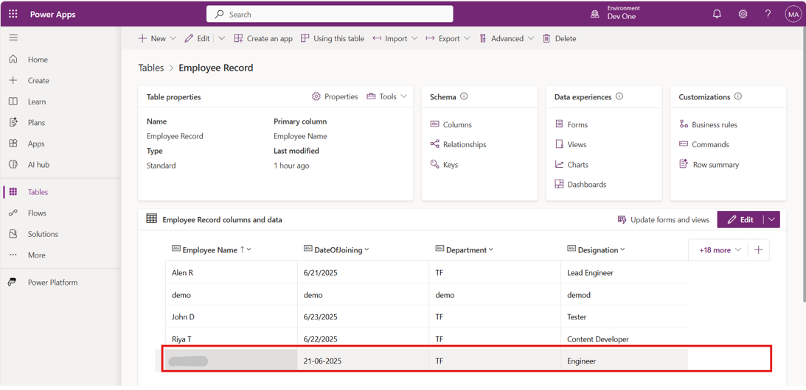

# **Lab 2: Create an agent that helps HR with onboarding a new employee**

**Estimated Duration**: 60 min

**Objective**: In this lab, you will learn how to automate the employee
onboarding process at by building the Agent. As a member of the HR team,
you are building an HR agent to simplify the employee onboarding
process. You will create an agent that can perform the following
activities: 

- Provide general information and answer queries that relate to employee
  onboarding. 

&nbsp;

- Submit a request automatically to onboard a new employee through the
  system. 

&nbsp;

- Send an onboarding request approval email automatically to the hiring
  manager that includes tasks, such as procuring a laptop, setting up an
  email account, and other onboarding essentials. 

&nbsp;

- Analyze the response for approval after the hiring manager responds to
  the email. Then, based on the response, take action to send an email
  to the IT/procurement team to procure a laptop and set up their
  access. 

&nbsp;

- Wait for the IT/procurement team to confirm procurement and then email
  the new employee with onboarding instructions. 

## **Exercise 1: Create the autonomous agent **

### **Task 1: Create a custom table in Dataverse**

A Dataverse table named Employee Record is used to store all employee
onboarding details collected by the chatbot.

1.  Go to the Power Apps maker portal using
    +++https://make.powerapps.com/+++ and if required sign in with the given
    Office 365 Admin tenant credentials.  

2.  Open the **Employee details** excel sheet located in the VM **C:\Labfiles** folder. Enter your email address under the **Email** column and enter given Mod Admin’s email id under the **ManagerEmail** column for all the entries. Save the changes and close the excel sheet. 

> 

3.  Navigate to **Power Apps** > **Tables** > select **Create new
    tables** from the **New table** dropdown.

> 

4.  From Choose an option to create tables window select **Import an
    Excel file or CSV**.

> 

5.  Click on **Select from device** \> select and open your **Employee
    details** Excel file

6.  Once the file is loaded successfully, click **Import.**

> 

7.  Select the table and click on **View data.**

> 

8.  Select the column \> **edit column** and set it to the **Text**
    type.

9.  Configure the table:

> Employee ID: **Text**
>
> Employee Name: **Text**
>
> Email: **Text**
>
> Department: **Text**
>
> Designation: **Text**
>
> Date of Joining: **Text**
>
> Manager’s email: **Text**
>
> **Note**: This table acts as the central database for storing all
> relevant employee onboarding data.
>
> **Note:** In my case the employee details table saved as employee
> record.

10. Again, select **Save and exit** on the **Done working** pop-up. 

> 

### **Task 2: Create an Autonomous Onboarding gent **

1.  To create a new agent in Copilot Studio, sign in to Copilot Studio
    using <https://go.microsoft.com/fwlink/?LinkId=2107702> with the
    given Office 365 Admin tenant credentials. Complete the
    authentication process and then select **Sign In**. 

>  

2.  Fill up the following required information and then select **Get
    Started**. 

> **Country or Region** – United States 
>
> **Job title** – Your job title 
>
> **Business phone number** – Your phone number 
>
>  
>
>  

3.  Under Confirmation details step, select **Get Started**. 

>  

4.  Select United States as **Country or Region** and then select **Get
    Started**. 

>  

5.  Click on the **Environment selector** and then select **Dev One**
    environment. 

>  

6.  Select **Skip** on the pop-up that states **Welcome to Copilot
    Studio!**. 

>  

7.  Select **Create** in the left navigation pane then select the **New
    Agent** box. 

>  

8.  From the **Create New Agent** screen, select **Skip to configure**
    to create the agent manually you can choose from two methods to
    create an agent. 

>  

9.  The **Create New Agent** screen has three
    fields: **Name**, **Description**, and **Instructions**. Enter the
    following information in these fields: 

- **Name** - Employee Onboarding Agent 

&nbsp;

- **Description** - An agent developed to simplify the employee
  onboarding process. 

&nbsp;

- **Instructions** - You are an agent responsible for employee
  onboarding. After you receive the onboarding request from HR, validate
  it and send the employee details to the hiring manager for approval.
  When the hiring manager approves it, forward the information to the IT
  and procurement teams so they can complete their respective tasks.
  After they finish their tasks, send the onboarding confirmation along
  with the onboarding instructions to the employee. 

>  

10. Select the **Create** button to create the agent. 

>  

### **Task 3: Enhance agent intelligence **

You can enhance the **Employee Onboarding Agent** that you created in
the previous task by adding knowledge and intelligence to the agent. 

1.  To add generative reasoning to the agent, in
    the **Orchestration** section, turn on **Use generative AI to
    determine how best to respond to users and events**. This selection
    allows generative AI reasoning to respond to questions from
    different users. 

>  
>
> **Note**: In addition to enhancing knowledge from generative AI, you
> can use the **Knowledge** section to add your enterprise knowledge
> base. 

2.  To upload your resources and create a knowledge base, select
    the **Add knowledge** button to ensure that your agent has the
    information for accurate and efficient responses. 

>  

3.  In the **Add knowledge** wizard, select **Dataverse** to connect the
    table. 

>  

4.  On Step **1 of 3: Select Dataverse tables** wizard page, follow
    these steps to connect the table from Dataverse: 

- In the search bar, search for the table named **Employee Record**. 

- From the list of tables that contain **Employee Record** in their
  names, select the table that you want to connect to. You can select
  multiple tables as a knowledge source. 

- Click **Add** to continue. 

>  
>
>  

## **Exercise 2: Create the Agent flow** 

1.  Go to Copilot Studio Agent overview page.

2.  Navigate to **Flows** \> **+ New Agent flows** \> select **Instant
    cloud flows**

> 

3.  Click on **Add a trigger** button to add triggers to the flow

### **Task 1: Add When an agent calls the flow**

This is the trigger used in Power Automate. The flow starts when the
Copilot agent calls it. You'll use the **"When a Power Virtual Agents
call this flow"** trigger.

1.  Click on the trigger button, search and select **When an agent calls
    the flow** trigger.

> 

2.  Configure “**When an agent calls the flow”** trigger by following
    the steps below.

3.  Add the following input parameters to the flow.

> Employee ID
>
> Employee Name
>
> Email
>
> Department
>
> Designation
>
> Date of Joining
>
> Manager’s email
>
> 

4.  Click on collapse icon **\<\<** to save the changes.

### **Task 2: Add “Add a new row” trigger**

This trigger refers to potential enhancements where you might want to
act upon changes to the Dataverse table.

1.  Click on **Add action +sign** after when an agent calls the flow
    trigger.

2.  Search and select **Add a new row** trigger.

> 

3.  Configure **Add a new row** action.

> You will use the **Dataverse connector** to add employee responses
> into the Employee Record table.
>
> **Action:** Add a new row
>
> **Table name**: Employee record  
> **Details to map**: Map dynamic variables to each parameter.
>
> Employee ID
>
> Employee Name
>
> Email
>
> Department
>
> Designation
>
> Date of Joining
>
> Manager’s email
>
> **Note**: This step ensures all collected data is stored properly in
> the Dataverse table.
>
> 

4.  Click on collapse option to close the configuration window.

### **Task 3: Add “Send an email (V2)” Trigger (For HR)**

You will send a notification to the HR team to inform them that a new
employee onboarding request has been submitted.

1.  Trigger an email notification to the HR team once a new row is
    added.

2.  Click on **Add new action node +,** search and select **Send an
    email** trigger

> 
>
> 

3.  Configure the “**Send an email**” trigger

> **To:** HR (MOD Admin email – Start typing Admin and select MOD Admin
> from the suggestion)  
> **Subject:** New Employee Onboarding Request  
> **Body:**
>
> Dear HR,
>
> Please start the onboarding process for the new employee:
>
> Name: /Employee Name \<Select **Employee Name** from Dynamic content\>
>
> Department: /Department \<Select **Department** from Dynamic content\>
>
> Start Date: /Date of joining \<Select **Date of joining** from Dynamic
> content\>
>
> Regards,

HR Onboarding Assistant

> **Note**: Set up the **dynamic value** for each parameter using
> triggerBody.
>
> 

### **Task 4: Add “Send an email” Trigger (For Employee)**

You now configure another email step to acknowledge the employee about
their onboarding.

1.  Again, add **Send an email** action to send the confirmation email
    to the respective employees for their onboarding request

2.  Click on add a new action “**+”** sign to add Send an email trigger

> 

3.  Configure send an email action

> **To**: [Your](mailto:sadhanak@technofocus.co) email id (emp email)
>
> **Subject**: Welcome to the Team
>
> **Body**: Hello
>
> Congratulations! You have been successfully onboarded at TF.
>
> Start Date:\<Select **Date of joining** from Dynamic content\>
>
> Department:\<Select **Department** from Dynamic content\>
>
> Welcome aboard!
>
> Regards,
>
> Contoso Onboarding Assistant
>
> 
>
> 

4.  After all the necessary actions are added click on **Save draft**
    and **Publish**.

5.  Once both email actions and Dataverse actions are configured, click
    **Save** and then **Publish** the flow to make it available to the
    Copilot agent.

### **Task 5: Rename the flow**

Rename the flow from untitled to Onboarding agent flow

1.  Open overview page of the **flow**, click on **Edit** button to view
    the details

2.  Change the flow name to Onboarding agent and Save

**Name**: onboarding agent

> 

**Note**: This name will be referenced inside your chatbot topic.

## **Exercise 3: Test the flow**

Manually test the flow from Power Automate or from within Copilot Studio
to verify:

- Emails are sent

- Data is added to Dataverse

1.  Click on **Test** icon on the right corner of the window , select
    **Test manually.**

2.  Provide the demo inputs and click **Run flow.**

3.  Successful run triggers an email to HR, employee confirmation mail,
    and logs the input in the Employee Record table of **Dataverse**.

> 
>
> 

## **Exercise 4: Create Agent Topics**

### **Task 1: Create Employee Details Topic**

1.  Go to **Employee Onboarding Agent** overview page.

2.  Navigate to Topics tab, click **+ Add a topic** and choose **From
    blank** to start a new topic manually.

> 

3.  Configure the topic:

> **Name:** Employee details  
> **Description:** An agent developed to simplify the employee
> onboarding process.
>
> **Phrases:**

- Onboarding request

- Help me onboard to TF

> These trigger phrases allow users to begin the conversation naturally.
>
> 
>
> 

4.  Add the below question nodes to collect user input.

5.  **Question node 1:**

**Question:** Enter your full name?  
**Identify as:** User’s entire response  
**Var:** empname

> 
>
> 

6.  **Question node 2:**

> **Question:** What is your employee ID?  
> **Identify as:** User’s entire response  
> **Var:** empId
>
> 
>
> 

7.  **Question node 3:**

> **Question:** Provide your email Id  
> **Identify as:** User’s entire response  
> **Var:** email
>
> 

8.  **Question node 4:**

> **Question:** Enter the department name  
> **Identify as:** User’s entire response  
> **Var:** dept
>
> 

9.  **Question node 5:**

> **Question:** Enter the date of joining  
> **Identify as:** User’s entire response  
> **Var:** doj
>
> 

10. **Question node 6:**

> **Question:** Enter the designation  
> **Identify as:** User’s entire response  
> **Var:** dsgn
>
> 

11. **Question node 7:**

> **Question:** Enter the Manager’s email address  
> **Identify as:** User’s entire response  
> **Var:** mgremail
>
> 
>
> **Note**: These questions collect the required data to be sent to
> Power Automate.

12. **Add the agent flow to the topic**

13. After all questions, use the **Call an action** node, and select the
    flow: onboarding agent

> 

14. Map the following variables:

- text_1: empname

- text_2: empId

- text_3: email

- text_4: dept

- text_5: doj

- text_6: dsgn

- text_7: mgremail

> 
>
> 
>
> 

15. Now, add a **confirmation message as a message node**

> **Message:**
>
> “Thank you for providing your onboarding details. Your request has
> been forwarded to the HR team. You will receive a confirmation email
> upon successful completion of the onboarding process."
>
> 
>
> 
>
> **Note**: This assures the user that the onboarding process has been
> successfully triggered.

### **Task 2: Configure Conversation start topic**

Optionally configure your **Conversation start** topic to redirect to
employee details so it automatically starts when the user types
onboarding-related phrases.

1.  Go to **Topics** \> **Systems** \> select **Conversation Start**
    topic.

> 

2.  Update the message as required and close the window.

> 

### **Task 3: Save and test the agent**

1.  Click on **Save** button to save the configuration for the agent.

2.  Click on **Test** icon on the right corner of the window and test
    the agent providing the phrases added to the Conversation Start
    topic.

> 
>
> 
>
> 

3.  To validate correct email and data logging, go to MOD Admin’s
    outlook account to check if Manger’s email is triggered.

> 

4.  Now go to the employee’s Outlook account to check Employee
    confirmation email is triggered.

> 

5.  Employee input logged into the Dataverse Employee Record table.

**Summary**: In this lab, you learnt how to integrate Dataverse for data
storage, use agent flow, enhance agent functionality by adding knowledge
source, customize conversation topics to improve user interaction. You
learnt how to automate key onboarding tasks such as generating employee
records and sending emails.

