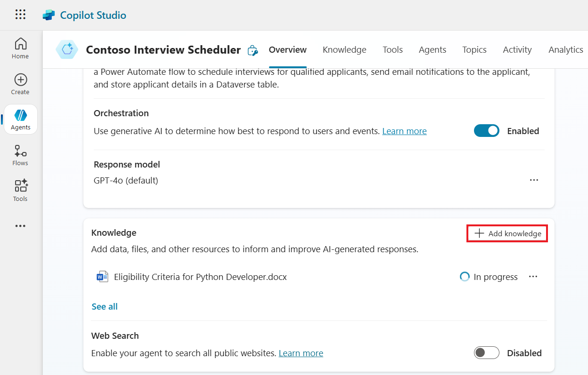
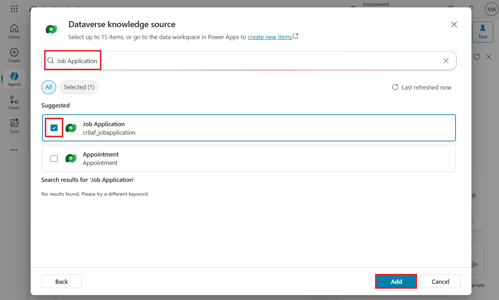
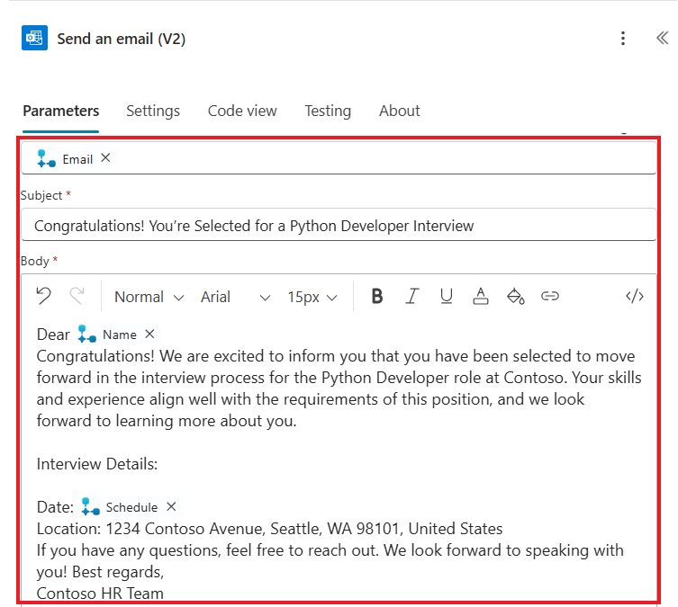
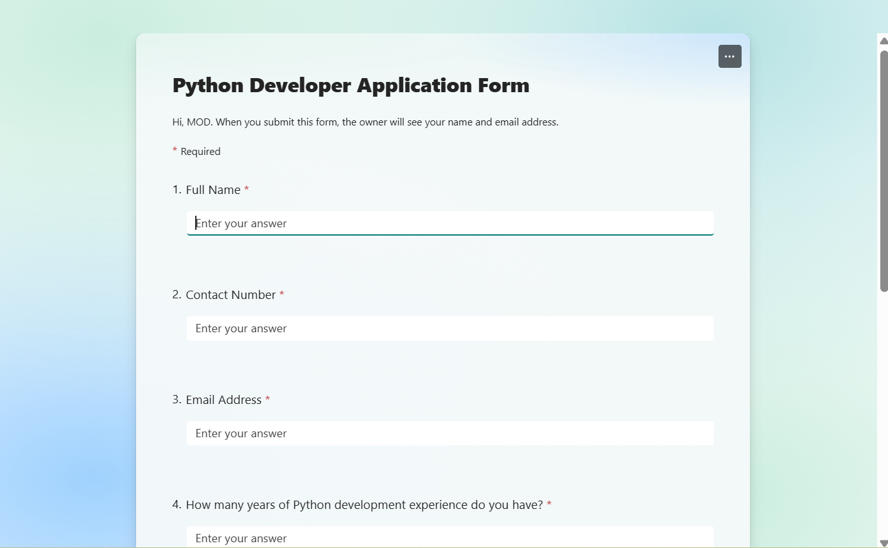
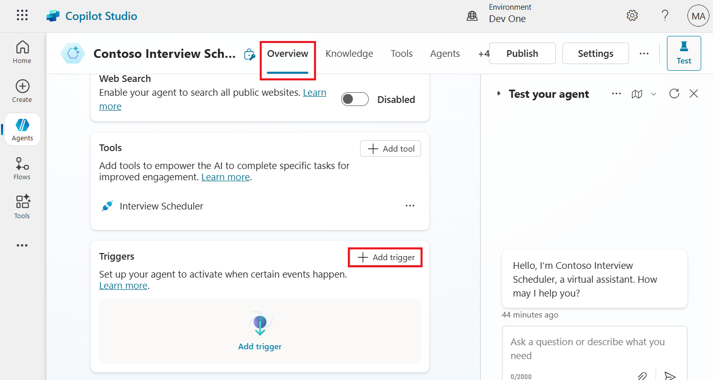
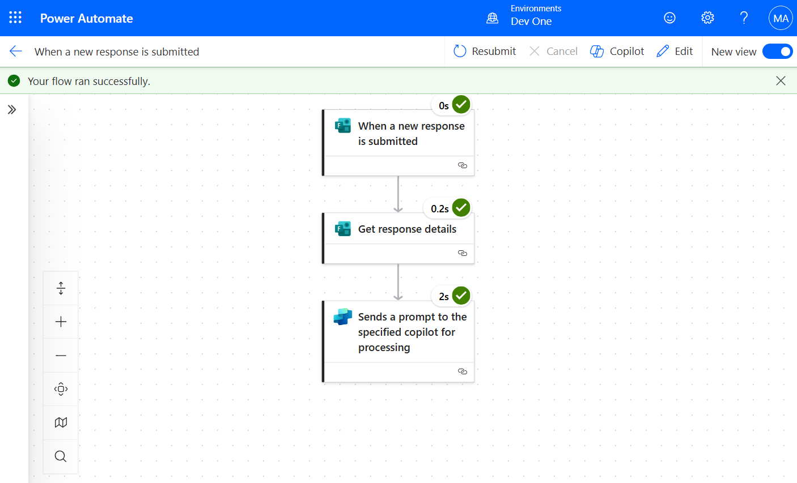

**Lab 3: Design a Smart Autonomous Agent for Recruitment Workflows**

**Estimated Duration**: 60 min

**Objective**: In this lab, you will learn how to automate the HR
recruiting process by building an Autonomous Copilot Agent that analyses
candidate applications, shortlists candidates based on job descriptions,
saves their details into Dataverse, and sends interview invitations to
selected candidates. You will create an agent that can perform the
following activities: 

- Analyze Candidate Details: The copilot automatically analyses
  application received by email, extracting relevant details.

- Match Job Requirements: The copilot compares the extracted candidate
  details with job descriptions. If the candidate meets the
  qualifications, they are shortlisted.

- Shortlist and Data Entry: Shortlisted candidates' details are saved
  into Dataverse, streamlining the data entry process for HR staff.

- Send Interview Invitations: For selected candidates, the copilot
  automatically sends an email with interview details, including the
  date, time, and location, eliminating the need for HR to send these
  manually.

## **Exercise 1: Create and Configure Contoso Agent**

1.  In the Copilot Studio home section from top select the **Dev One**
    environment.

> 

2.  On the Welcome copilot studio tab, click on the **Skip** to move
    forward.

> 

3.  From left navigation bar select **Create** and then select **New
    agent** to start creating new agent.

> 

4.  From top right corner click on **Skip to configure** button.

> 

5.  Enter **Name, Description and Instruction** of the agent as given
    below and click on **Create** button.

> **Name:** Contoso Interview Scheduler
>
> **Description:** The Contoso Interview Scheduler Agent automates
> hiring by analysing applicants' skills, filtering eligibility,
> scheduling interviews for qualified candidates, sending email
> notifications, and storing applicant data in Dataverse.
>
> **Instruction:** To create the Contoso Interview Scheduler Agent,
> start by setting up a Copilot agent and adding a form trigger to
> collect applicant information. Integrate a knowledge source with job
> descriptions for skill analysis. Next, build a Power Automate flow to
> schedule interviews for qualified applicants, send email notifications
> to the applicant, and store applicant details in a Dataverse table.
>
> 

6.  On the Overview page of Agent, **enable** the orchestrator for the
    agent.

> 

7.  On overview page of the agent, **disable** the “**Enable your agent
    to search all public websites**” option.

> 

8.  From the top right corner of the agent, click on
    the **Settings** button.

> 

9.  Then go to the **Generative AI** section, select **Yes - Responses
    will be dynamic, using available tools and knowledge as
    appropriate**.

> 

10. Scroll down and set content moderation as **Medium** by using
    horizontal slider and click on **Save** to save the setting.

> 

## **Exercise 2: Get Started with Power Apps**

### **Task 1: Set Up a Dataverse Table**

1.  Go to Power Apps home page using <https://make.powerapps.com/>. From
    the environment selector, select the **Dev One** environment.

> 

2.  From the left navigation bar select **Tables.** In the tables
    section top bar click on the **+ New table** and then
    select **Create new tables**.

> 

3.  Select **Import an Excel file or CSV** option to create a new table.

> 

4.  Click on the select form device option and select **Interview
    Schedule** excel file from **Lab Files** folder.

> 

5.  Select **Import**.

> 

6.  Select the table and click on **View data** to see the table.

> **Note:** In this case, the table is named ***Job Application***. The
> name may vary with each execution. Save the table name for future
> reference.
>
> 

6.  Select the first row of the table and click on the **Delete rows**.

> 

7.  Select **Delete**.

> 

8.  Go to table data, select **Skill** down arrow, select **Edit
    column**.

> 

9.  Set the data type as **Text** \> **Multiple line** \> **Plain
    Text**.

> 

10. and click on the **Update**.

> 

8.  Select **Interview Schedule** down arrow, select **Edit column**.

> 

9.  Set the data type as **Single line of text**.

> 

10. click on the **Update**.

> 

9.  From top right side click on **Save and exit** to save the table.

> 

10. Select **Save and exit**.

> 

## **Exercise 3: Configure Agent Knowledge Sources and Conversation Topics**

In this exercise, you'll learn how to enhance your agent by adding
knowledge sources and customizing conversation topics. First, you'll add
knowledge sources, including a document file and a Dataverse table, to
your agent. Then, you'll customize the conversation start topic by
modifying the default message to improve user interaction. This exercise
will help you personalize the agent’s responses and integrate relevant
data for a more efficient experience.

### **Task 1: Add Knowledge Sources to the Agent**

1.  Navigate to overview section of the agent, scroll down and click on
    the **+ Add knowledge.**

> 

2.  Click on the **Click to browse** button and select the lab
    file **Eligibility criteria for python developer** doc file.

> 

3.  After selection of file click on the **Add** button to add the file.

> 

3.  Again, go to the **Overview** section of the agent, scroll down and
    click on **+ Add knowledge** button.

> 

4.  From Add knowledge window select **Dataverse** as the source.

> 

5.  From the top right corner search bar search for **Job Application**,
    select **Job application** Dataverse table and click on
    the **Add** Button.

> 

### **Task 2: Customize the Conversation Start Topic**

1.  Navigate to the **Overview** section of the agent,
    select **Topics** from top bar and then select **Conversation
    Start** topic.

> 

2.  Scroll down the conversation start topic, go to Message node, after
    “virtual assistant” word remove remaining message and add **“How may
    I help you?**” message.

> 

3.  From top right corner click on the **Save** button to save the
    topic.

> 

## **Exercise 4: Test the agent**

1.  Navigate to the **Overview** section of the agent and from top right
    corner click on the **Test** to start testing.

> 

2.  Enter the prompt **“What is eligibility criteria?”** in the section
    and then submit it. It will return given below output.

> 
>
> 

3.  Enter the prompt **“Is SQL Database is required for the python
    developer position?”** in the section and then submit it. It will
    return given below output.

> 

## **Exercise 5: Create an Interview Scheduler Flow and Integrating It with Copilot**

In this exercise, you'll create a flow to schedule interviews and
integrate it with your Copilot agent. You'll set up a series of inputs,
such as name, email, and experience, to collect applicant information.
Then, you'll configure actions to add the data to a Dataverse table,
send an interview invitation email, and save and publish the flow.
Finally, you'll integrate the flow into your Copilot agent, enabling it
to automate the interview scheduling process.

1.  Navigate the **Overview** section of the agent, scroll down and
    click on **+ Add tool.**

> 

2.  Scroll down and click on the **Create a new flow** to create new
    power automate flow.

> 
>
> 

3.  Select **When an agent calls the flow** and click on the **Add an
    input.**

> 

4.  Select **Text** as input type.

> 

5.  Rename the input as **Name**.

> 

5.  With the same process make five more input as given below:

[TABLE]

> 

6.  Below **When an agent calls the flow**. Right click on
    the **+** Sign and select **Add an action.**

> 

7.  In **Add an action** window search for **Add a new row** and
    select **Add a new row** action from Dataverse section.

> 
>
> **Note**: Some time Dataverse connection is not created automatically,
> so participant need to **sign** in with their credential,
> authentication should be **OAuth.**
>
> 

8.  In the table name section search and select **Job
    Application** table.

> 

9.  Below table name click on **Show all** and click on the particular
    field and add the parameter with the help of dynamic content
    button **(Thunder bolt)** in the field as given below:

[TABLE]

> 

10. Collapse the **Add a new row** action pane.

> 

11. Below **Add a new row** action click on the **+** Sign and
    select **Add an action.**

> 

12. In **Add an action** section search for **Send an email office 365
    outlook** and select **Send an email** (V2) from office 365 outlook
    section.

> 

12. In send an email action, select **Settings** icon for the **To**
    field and then select **Use dynamic content**.

> 

13. Select **Email** from dynamic content.

> 
>
> 

14. Enter the given below content in the respected fields:

[TABLE]

> 

14. Close the **Send an email** pane.

>  
>
> 

15. From the top bar **Save draft** and **Publish** the flow.

> 

16. Select **Go back to agent**.

> 

17. Select **Untitled** flow.

> 

18. Name the flow as **Interview Scheduler.**

> 

17. Select **Inputs**.

> 

18. Click on **Customize** in **Name** field.

> 

19. Enter the **Description** as **Enter the name of the applicant**.

> 

19. Enter the description in the respected section as given below, after
    entering the description click on the **Save** button.

[TABLE]

> 

## **Exercise 6: Create Python Developer Application Form in Microsoft Forms**

In this exercise, you'll create a Python Developer Application Form
using Microsoft Forms. You'll sign in to Microsoft Forms, create a new
form titled "Python Developer Application Form," and add required fields
such as name, contact number, email, experience, skills, and interview
schedule. Once the form is created, you'll collect responses by
generating a URL and testing the form to ensure it works as expected.
This exercise helps you build a structured form to gather applicant
information efficiently.

1.  Navigate to Microsoft forms
    website <https://www.microsoft.com/en-gb/microsoft-365/online-surveys-polls-quizzes> and
    click on the **Sign in** button.

> 

2.  Enter the admin tenant id / work or school id on the field and click
    on the **Next** button.

> 

3.  Enter the password in the respected field and then click on
    the **Sign in** button.

> 

4.  Select **Yes** to stay signed in Microsoft forms.

> 

5.  Close the pop-up.

> 

6.  From the top left click on the **New Form** to start creating new
    form.

> 

6.  Add the heading "**Python Developer Application Form**". Select
    **Quick start with** and then select **Text**.to the form and create
    the following fields with their respective types. Turn
    on **Required** for all fields.

> 
>
> 
>
> 

[TABLE]

> 

7.  From the top click on the **Collect responses** button
    and **Copy** the URL.

> 
>
> 

8.  Open the new window tab and paste the URL and open the form.

> 

## **Exercise 7: Automate Applicant Eligibility and Interview Scheduling Using Copilot and Power Automate**

In this exercise, you'll automate the process of checking applicant
eligibility and scheduling interviews using Copilot and Power Automate.
You'll set up a trigger for when a new response is submitted to the
"Python Developer Application Form," process the responses, and check
the applicant's eligibility based on their skills and experience. If
eligible, the Interview Scheduler flow will be triggered with the
applicant's details. Finally, you will test the flow to ensure the
automation is working correctly, ensuring smooth integration of
applicant data and scheduling processes.

1.  Navigate back to copilot studio overview page window, scroll down
    and click on **+ Add trigger** button.

> 

2.  From the top right corner search for **Form** and select **When a
    new response is submitted** trigger and then click on
    the **Next** button.

> 

3.  Check if green check mark is appearing for the apps, then click on
    **Next**.

> 

4.  In the Form Id field select **Python Developer Application
    form** and then click on the **Create trigger**.

> 

4.  Select **Close** on **Add trigger** wizard.

> 

5.  Navigate to the **Overview** page, scroll down, click on the three
    dots **(…)** on **When a new response is submitted** trigger,
    select **Edit in Power Automate button** to start editing.

> 

5.  Right click on **When a new response is submitted** trigger and
    select **Delete** to remove the trigger.

> 
>
> 

6.  Click on Add a trigger in the canvas, on add a trigger window search
    and select **When a new response is submitted** trigger from
    Microsoft Forms.

> 

7.  In **the Form Id** field, select **Python Developer Application
    Form.**

> 

8.  Below When a new response is submitted trigger, click on
    the **+** sign and select **Add an action** button.

> 

9.  Search and select **Get response details** action from Microsoft
    Forms section.

> 

10. In **Form Id** field select **Python Developer Application** Form
    and in Response Id field select **Response Id** dynamic variable
    (Thunder bolt option)).

> 
>
> 

11. Close the **Get response details** pane.

> 

12. Select **Send a prompt to the specified copilot for processing**
    action. Enter the below given message in the body/message field.

> **Note**: There is multiple dynamic content variables are selected in
> the message please replace the message content with the help of
> dynamic content thunder bolt option.
>
> Gather information from **Python Skills (Variable)** and **How many
> years of Python development experience do you have? (Variable)**.
> Check the eligibility criteria of applicant. If applicant is eligible
> for python developer, run interview scheduler flow and use
> details **Full Name (Variable), Contact Number (Variable), Email
> Address (Variable), How many years of Python development experience do
> you have? (Variable), Python Skill (Variable), Interview Schedule
> (Variable).**
>
> 

12. Close the pane.

> 

13. From top bar click on **Save draft** and then **Publish** to publish
    the flow.

> 

13. Next to Save draft button click on the **Test** to test the flow.

> 

14. Select the **Manually** option and then click on the **Test.**

> 

15. Navigate to Form URL window and enter the following details in the
    form, then click on the **Submit**.

[TABLE]

> 

16. After submitting the form, navigate to flow test window, test flow
    will be completed.

> 

19. Go to the **Overview** section and from top right corner click
    on **Publish** and again click **Publish** to publish the copilot.

> 
>
> 

## **Exercise 8: Test the agent**

In this exercise, you will test the functionality of the agent to ensure
that it correctly processes applicant information and triggers actions
like shortlisting candidates for an interview. You will connect the
agent, initiate a test, check the Job Application table for applicant
details, and verify that an email is sent to the shortlisted candidate.
Additionally, you will test the agent's response to a prompt from the HR
Manager, ensuring the agent returns the correct details of the selected
candidate and interview schedule.

1.  Navigate to the agent **Overview** page, scroll down and click on
    the **Test** button on trigger and then select **Start testing**.

> 
>
> 

5.  The application successfully executed and applicant is shortlisted
    for the interview.

> 

6.  Navigate to Power Apps portal using <https://make.powerapps.com/>.
    Select **Dev One** environment.

> 

7.  Select **Tables** from the left pane. Select **Job Application**
    table.

> 

8.  Check the applicant details on the table.

> 

7.  After shortlisting the candidate, an email is sent to the applicant.

> 

8.  In the test window, HR Manager enter the prompt **“show me selected
    candidate detail and interview schedule “**. It returns the details
    of the applicants.

> 

**Summary**: In this lab, you learnt how to configure the agent’s
orchestrator and adjusted AI knowledge settings, created a new Dataverse
table by importing an Excel or CSV file, view and manage table data,
edited columns. You also learnt how to configure knowledge sources,
create an agent flow, create a Form using Microsoft Form to get employee
details and to test the entire workflow, ensuring that form submissions,
eligibility checks, and interview invitations were triggered as
expected.
