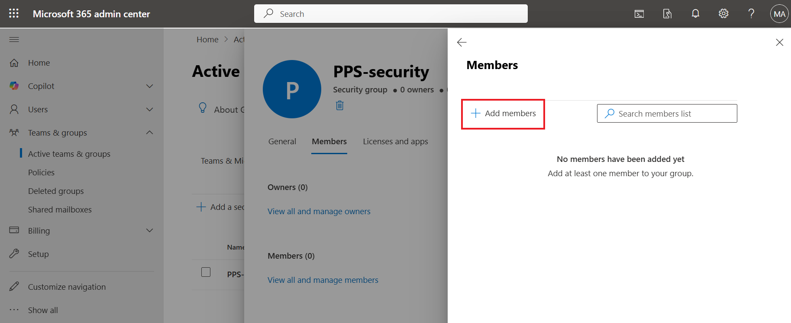
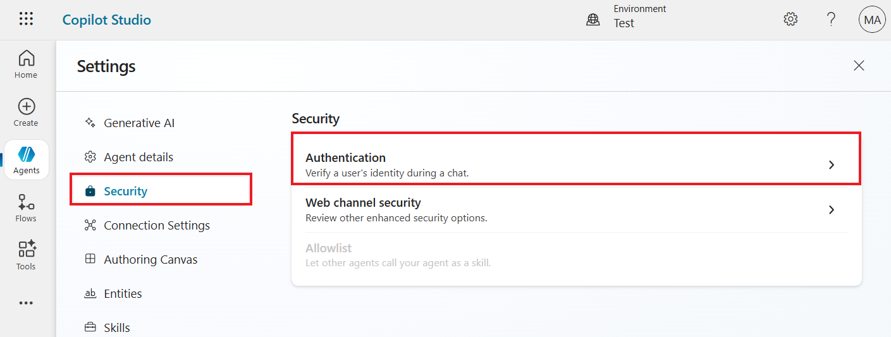
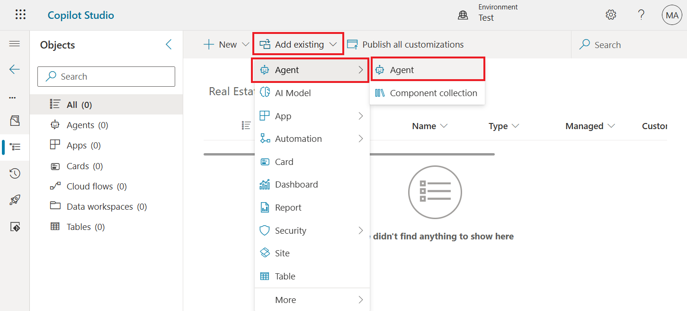

# **Lab 4: Configure Governance Controls for your Copilot Studio Agents**

**Estimated time:** 60 min

**Objective**: In this lab, you will learn how to create security group
and add members to the security group from the Microsoft 365 admin
center, import and share agent solutions, and enforce governance
policies using the Power Platform admin center. You will also learn how
to configure data access and deploy agents to ensure secure, scalable.

## **Exercise 1: Control user access to environments: security groups and licenses**

### **Task 1: Create a security group and add members to the security group**

1.  Open new tab in the same browser and navigate to **Microsoft 365
    admin
    center** using [**https://admin.microsoft.com**](urn:gd:lg:a:send-vm-keys).
    Sign in with your Office 365 tenant credentials.

2.  Select **Teams & groups** \> **Active teams & groups**.

> 

3.  Select **Security group** tab and then select **+Add a security
    group**.

> 

4.  Add the group Name: [**PPS-security**
    and** Description:**](urn:gd:lg:a:send-vm-keys) Power Platform
    security group and then click **Next**.

> 

5.  Click on **Create group** button.

> 

6.  Click on **Close** button to close the window.

> 

7.  Select the PPS-security group you created.

> 

8.  Select **Members** tab and then click on **View all and managed
    members** hyper link.

> 

9.  Click on **+ Add members**.

> 

10. Select the first three users (For example here, Brooke, Connie and
    Jacob) to add to the security group and then select **Add(3).**

> 

11. **Close** the ‘Members’ pane to return to the **Groups** list.

> 

12. You have completed this task, please do not close the tab and 
    proceed ahead with the next task.

**Task 2: Associate a security group with a Dataverse environment**

1.  Open new tab and navigate to Power Platform admin center
    using [**https://admin.powerplatform.microsoft.com**](urn:gd:lg:a:send-vm-keys) and
    if required, sign in with your Office 365 tenant credentials. 

2.  In the navigation pane, select **Manage \>** **Environments**, and
    then select **+New**.

> 

3.  On the New environment window, enter the following information.

> **Name:** Test
>
> **Region**: United States – Default
>
> **Type**: Trial
>
> **Add a Dataverse data store**: Yes
>
> 
>
> 

4.  Keep the **Language** as **English (United States)**, **Currency**
    as **USD** and then click on **+** **Select**.

> 

5.  Under the **Restricted access**, select **PPS-Security** and then
    select **Done**.

> 

6.  You can see under Security group, **PPS-security** group is added
    and then select **Save**.

> 

## **Exercise 2: Create an agent**

### **Task 1: Create an agent**

1.  Navigate to [Microsoft Copilot
    Studio](https://copilotstudio.microsoft.com/) using
    <https://copilotstudio.microsoft.com/>. Sign in with your Office 365
    Admin tenant credentials.

2.  From the environment selector, select **Test** environment that has
    the tables you created in the previous exercise.

> 

3.  Select **Create** from the left navigation pane and select the **New
    agent** tile.

> 

4.  Select **Skip to configure** in the top-right corner of the agent
    creation screen.

> 

5.  In the **Name** text box, enter **Real Estate Booking Service.**

> 

6.  In the **Description** text box, enter **Create bookings for real
    estate properties.**

7.  In the **Instructions** text box, enter **Speak courteously and
    mimic the behavior of a real estate agent.** Select **Create**.

> 

### **Task 2: Configure Security**

1.  Select **Settings** in the top-right of the **Real Estate Booking
    Service** agent's screen.

> 

2.  Select the **Security** tab and then select
    the **Authentication** tile.

> 

3.  Select **No authentication** and select **Save**.

> 

4.  Select **Save** in the **Save this configuration?** window.

> 

5.  Close the **Settings** menu and return to your **Real Estate Booking
    Service** agent.

> 

## **Exercise 3: Configure DLP to block Power Platform connectors in the Power Platform admin center**

**Task 1: Create a policy**

1.  Navigate to Power Platform admin center
    using [**https://admin.powerplatform.microsoft.com**](urn:gd:lg:a:send-vm-keys) and
    if required, sign in with your Office 365 tenant credentials. 

2.  From the left navigation pane, select **Security**.
    Under **Security**, select **Data and privacy** then select **Data
    policy** tile.

> 

3.  To create a new policy, select **+New policy**.

> 

4.  Enter name of the policy **- PP-Connector Policy** and
    click **Next**.

> 

5.  In the search box, type **MSN**, select **more actions** (3 dots)
    for **MSN Weather** connector and then select **Block**.

> 

6.  Select **Blocked** tab, you can see **MSN Weather** connector which
    you have just blocked. Select **Next**.

> 

7.  Do not add any connectors and click on **Next**.

> 

8.  In **Scope**, select **Add multiple environments** and then
    click **Next.**

> 

9.  Select your **Test** trial environment and then click on **+Add to
    policy**.

> 

10. Select **Added to policy** tab and then click **Next**.

> 

11. **Review** the policy and then click on **Create policy**.

> 

12. Your **Policy** got created.

> 
>
> **Task 2: Confirm policy enforcement**
>
> You can confirm that this connector is being used in the DLP policy
> from Copilot Studio:

1.  Go back to Copilot Studio portal. Ensure that You are in **Test**
    environment where the DLP policy is applied.

> 

2.  Select **Agents** from the left navigation pane. Open **Real Estate
    Booking Service** agent.

> 

3.  Select **Topics** tab. Select **Custom(4)** tab.

> 

4.  Select **+ Add a topic** \> **Add from description with Copilot**.

> 

5.  Enter following Information and then select **Create**.

> **Name your topic:** Property Viewings Scheduling
>
> **Create a topic to...:** This topic would allow users to schedule
> property viewings directly through the chatbot, streamlining the
> booking process and enhancing the user experience
>
> 

6.  For a better view, close the **Edit with Copilot** pane.

> 

7.  At the end of the last node select **+** icon to add new node.

> 

8.  Select **Add a tool** node and then select **Connector** tab.

> 

9.  In the node's properties, select **Connectors** and choose your
    connection. Save your topic.

> 

10. Click on **Not connected** and select **Create new connection**.

> 

11. Select **Create**.

> **Note**: If asked, sign in with the given Office 365 tenant
> credentials.
>
> 

12. You can see the message as Connection creation has been blocked by
    Data Loss Prevention (DLP) policy ‘PP-Connector policy’. This shows
    your policy is enforced.

> 

## **Exercise 4: Import and Export a Copilot Studio Agent Solution**

**Task 1: Export an Agent into Copilot Studio**

1.  In Copilot Studio, select the menu icon (**…**) on the side
    navigation pane, and then select **Solutions**.

2.  Select **+New solution**.

3.  Enter the following information and then select **+New publisher**.

**Display name**: Real Estate

**Name**: RealEstate

4.  On the **New publisher** pane, enter the following information and
    then select **Save**.

**Display name:** Booking Service

**Name:** BookingService

**Prefix**: book

5.  Now on the **New solution** pane, a new publisher name, i.e.
    **Booking Service**, has been selected already. If not, then select
    it from the drop-down list.

6.  Now, you will be in **Real Estate** solution.

7.  Click on the **Add existing** drop-down then select **Agent** \>
    **Agent**.

8.  Select **Real Estate Booking Service** agent and then click on the
    **Add** button.

9.  After adding the agent to the solution, select **Publish all
    customizations**.

10. When you see the message ‘**Publish all customizations succeeded’**
    then click on the back arrow to go back to the **Agents** page.

11. On the Copilot Studio portal, select Agents from the left navigation
    pane. Click the **ellipsis (...)** icon on the **Real Estate Booking
    Service Agent** and select **Export Agent**.

12. In the **Agent Solution**, click the **ellipsis (...)** icon again
    and select **Export solution**.

13. Click **Next** to proceed.

14. Select the **Unmanaged** option and then click on the **Export**
    button.

15. You can see the given message, ‘Currently exporting solution’.

16. Once the export is complete, click on the **Download** button from
    the top. The agent will be downloaded to the **Downloads** folder in
    the VM.

> **Task 2: Import Agent into Copilot Studio**

1.  On the Copilot Studio portal, click on the **Environment selector**
    and select **Dev One** environment.

2.  In Microsoft Copilot Studio, click on **Agents** from the left-hand
    menu and then click on the **Import Agent.**

3.  In the top menu bar, click **Import** **solution**.

4.  Click the **Browse** button and navigate to the Lab Files folder on
    the virtual machine.

5.  Select the **RealEstate solution** lab file from the Downloads
    folder on the VM, click on the **Open** button.

6.  Select **Next** to proceed.

7.  Click the **Import** button to import the agent solution.

8.  After successful import, select the newly imported agent solution.
    Click on the **More commands** (3 dots).

9.  Click **Set preferred solution** from the top bar.

10. Click **Apply** to confirm the selected solution.

**Task 3: Share Agent with Another User**

1.  Click on the **ellipsis (...)** icon on the **Contoso Agent** and
    select **Share**.

> 

2.  In the **New User** field, enter **Sara** and select the user **Sara
    Perez** from the dropdown.

> 

3.  Click on the **Update** button to share the agent.

> 

4.  After successful sharing, click the **Close (X)** icon to exit the
    sharing window.

> 

## **Exercise 5: Configure Access and Deploy Copilot Studio Agent**

**Task 1: Configure Data Access for Specific Users**

1.  From the left-hand menu under **Copilot**, click **Settings**.

> 

2.  Go to the **Data Access** section and click on **Agent**.

> 

3.  Choose **Specific users/group** option.

> 

4.  Enter and select **MOD Administrator** and **Sara Perez** users then
    click **Save** to apply access settings.

> 

**Task 2: Deploy Agent and Assign User**

1.  In the left menu under **Copilot**, click **Agent and Connectors**.

> 

2.  In the Agent Inventory, search for **Microsoft 365**, then open the
    **Admin Agent**.

> 

3.  Click **Deploy** from the top options and then click on the **Next**
    button.

> 
>
> 

4.  Select on the **Just me** option, and then click on the **Next**
    button.

> 

5.  Click **Next** again, then click on the **Finish deployment**
    button.

> 
>
> 

6.  Click **Done** to complete.

> 

7.  To assign new user access, go to **Users**, then select **Deployed
    to**.

8.  Select **Specified user/group**,

> 

9.  Enter **Sara** and select the user, **Sara Perez**.

> 

10. Click on the **Update** button to add new user.

> 

11. Click the **X** on the top-right to close.

> 

**Task 3: Test Microsoft 365 Admin Copilot Agent Functionality**

1.  Open a Microsoft Edge new tab and navigate to office 365 copilot
    <https://www.office.com/> then click on the **Sign in** button.

2.  If asked, sign in with the given **Office 365** **Admin tenant
    credentials.**

3.  On the left-hand menu, locate and click on the **Microsoft 365 Admin
    Agent**.

**Note:** If the agent doesn’t appear immediately, wait a few minutes
for it to load.

4.  Click on the **“Learn admin tasks”** prompt to test the agent. Click
    the **Execute** button to run the prompt.

5.  The prompt will run and return the results, confirming successful
    execution.

**Summary**: In this lab, you learnt to create a security group, add
members and associate it with Dataverse environment. You created a DLP
policy and examined its impact on the agent. You imported agent from
trial environment to developer environment and shared that with the
user.
