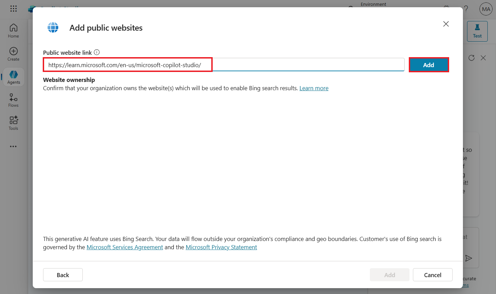

# **Lab 5: Control knowledge source with public websites in Copilot Studio**

**Estimated Duration:** 20 min

**Objective:** In this lab, you will learn how to create data loss
prevention (DLP) policies to configure which knowledge sources across
environments that agent authors can connect to for data.

## **Exercise 1: Configure knowledge sources for agents in Power Platform admin center**

**Task 1: Create a policy**

1.  Navigate to Power Platform admin center
    using [**https://admin.powerplatform.microsoft.com**](urn:gd:lg:a:send-vm-keys) and
    if required, sign in with your Office 365 tenant credentials. 

2.  From the left navigation pane, select **Security**.
    Under **Security**, select **Data and privacy** then select **Data
    policy** tile.

> 

3.  To create a new policy, select **+New policy**.

> 

4.  Enter name of the policy **- PP-Knowledge Src Policy** and
    click **Next**.

> 

5.  For connectors pertaining to agent knowledge sources, search for
    "Knowledge source". You should see three connectors in the
    results: **Knowledge source with SharePoint and OneDrive in Copilot
    Studio**, **Knowledge source with public websites and data in
    Copilot Studio**, and **Knowledge source with documents in Copilot
    Studio**.

> 

6.  Select **Knowledge source with public websites and data in Copilot
    Studio** and then select **Block**.

> 

7.  Select **Blocked** tab, you can see **Knowledge source with public
    websites and data in Copilot Studio** connector which you have just
    blocked. Select **Next**.

> 

8.  Do not add any connectors and click on **Next**.

> 

9.  In **Scope**, select **Add multiple environments** and then
    click **Next.**

> 

10. Select your **Test** trial environment and then click on **+Add to
    policy**.

> 

11. Select **Added to policy** tab and then click **Next**.

> 

12. **Review** the policy and then click on **Create policy**.

> 

13. Your **Policy** got created.

> 

**Task 2: Confirm policy enforcement**

You can confirm that this connector is being used in the DLP policy from
Copilot Studio:

1.  Go back to Copilot Studio portal. Ensure that you are in **Test**
    environment where the DLP policy is applied.

> 

2.  Select **Agents** from the left navigation pane. Open **Real Estate
    Booking Service** agent.

> 

3.  Go to the **Knowledge** tab, select **Add knowledge**.

> 

4.  Select **Public websites** knowledge source.

> 

5.  Add the sample website given
    <https://learn.microsoft.com/en-us/microsoft-copilot-studio/> and
    then select **Add**.

> 

6.  Select **Add**.

> 

7.  You can see the status as **Blocked** due to data loss prevention
    policy.

> 

**Summary:** In this lab, you learnt how to create data loss prevention
(DLP) policies to control knowledge source with public website.
