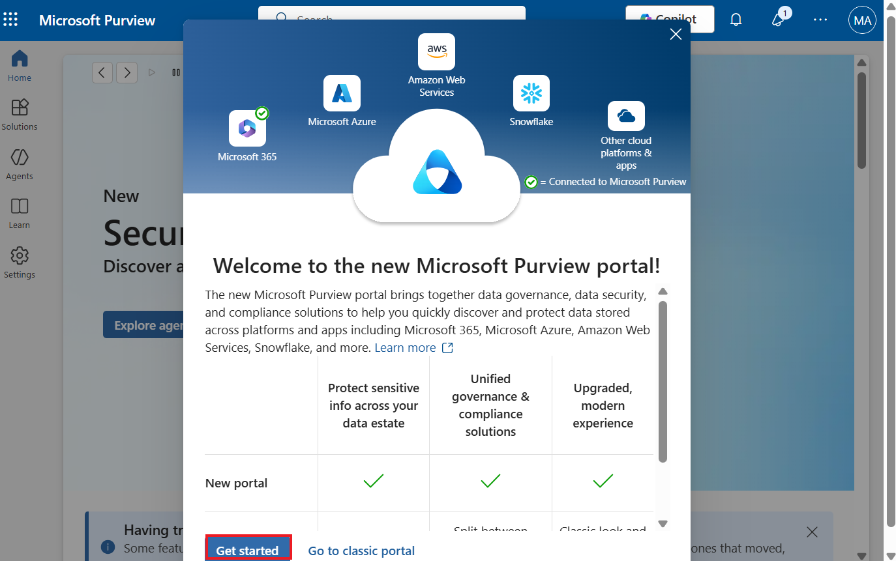
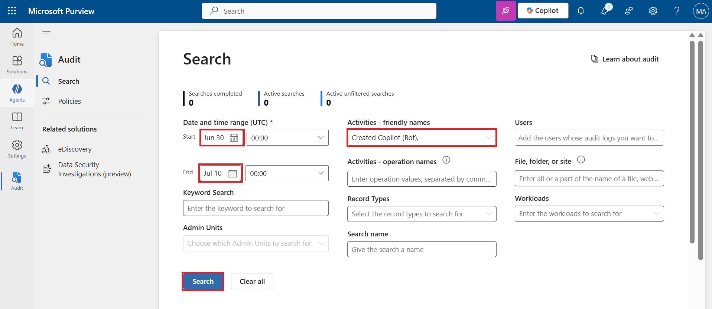

# **Lab 6: Audit Copilot Studio activities in Microsoft Purview**

**Estimated Duration:** 15 min

**Objective:** In this lab, you will learn how Copilot Studio logs
activities related to both administrative and maker and user
interactions with agents in Microsoft Purview.

1.  To access the logs, sign in to the [Microsoft Purview compliance
    portal](https://purview.microsoft.com/)
    using <https://purview.microsoft.com/> with the given Office 365
    Admin tenant credentials.

> 

2.  From the left navigation pane, select **Solutions** and then select
    **Audit**.

> 

3.  You can the **Search** window where you can search for the different
    activities.

> 

4.  From the drop-down menu of the **Activities – friendly names**, type
    **bot** in the search bar and select **Created Copilot (Bot)**
    listed under **Power Platform Copilot (Bot) Management.**

> 

5.  Configure **Start date** as 3-4 days before the current date and
    **End date** as current date and then select **Search**.

> 

6.  The search process has started. Select Refresh to check if the
    process is 100% completed.

> 

7.  To see the details of your search, select your search from the
    search name list.

> 

8.  From the drop-down menu of the **Activities – friendly names**, type
    **Copilot** in the search bar and select **Interacted with Copilot**
    listed under **Copilot activities**. Configure **Start date** as 3-4
    days before the current date and **End date** as current date and
    then select **Search**.

> 

9.  You can see the search status. Select **Refresh** if required.

> 

**Summary:** In this lab, you learnt how to audit Copilot Studio
activities in Microsoft Purview. It's important to audit actions such as
changes to the content and settings to help mitigate failures, help
contain systems of security constraints, adhere to compliance
requirements, and act on security threats.
